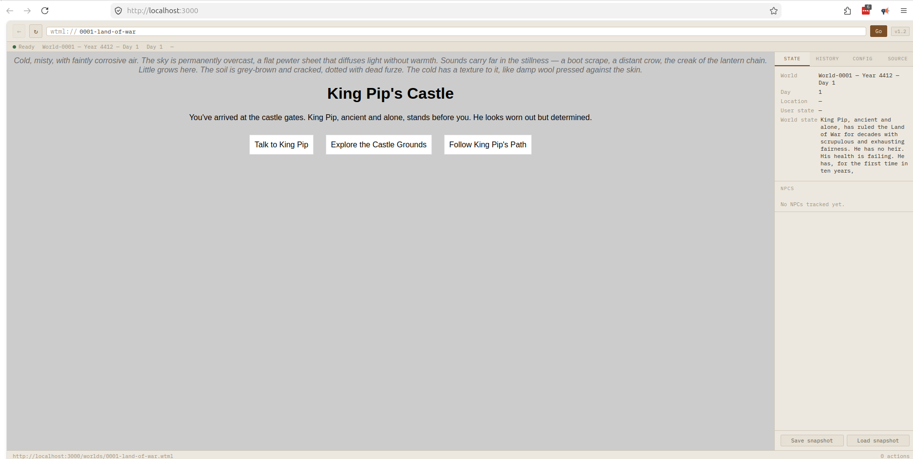

# World Web Browser — Local Setup

A complete implementation of the WW (World Web) spec v1.3  (see [World Web v1.3](https://philpapers.org/archive/BINWWS.pdf)). You can find a video demo [here](https://makertube.net/w/1E6JkKHma9uzCRREwgC7M8).

## Quick Start

### 1. Prerequisites

You need either:
- **Local LLM (recommended):** [Ollama](https://ollama.com) installed and running
- **Remote API:** An Anthropic, OpenAI, or compatible API key

### 2. Start Ollama (if using local LLM)

```bash
# Install a capable model (one-time download, ~4GB)
ollama pull llama3

# Ollama runs automatically in the background after install.
# Verify it's running:
curl http://localhost:11434/api/tags
```

### 3. Start the WWB server

```bash
# No npm install needed — uses only Node.js built-ins
node server.js
```

Open **http://localhost:3000** in your browser.

### 4. Configure the LLM

Click the **Config** tab in the sidebar:

| Setting | Ollama (local) | Anthropic | OpenAI |
|---------|---------------|-----------|--------|
| Provider | Local — Ollama | Remote — Anthropic | Remote — OpenAI |
| Model | llama3 | claude-3-5-haiku-20241022 | gpt-4o-mini |
| Endpoint | http://localhost:11434 | https://api.anthropic.com | https://api.openai.com |
| API Key | (leave blank) | sk-ant-… | sk-… |

Click **Save config**.

### 5. Load a world

In the address bar at the top, type:

```
wtml://0001-land-of-war
```

Press **GO** (or Enter). The browser will fetch the world, send it to the LLM, and render an interactive scene.

---

## File Structure

```
wwb/
├── server.js              # Local HTTP server (no dependencies)
├── browser.html           # The World Web Browser UI
├── worlds/
│   ├── 0001-land-of-war.wtml   # Starting world (King Pip)
│   └── 0001-heir-found.wtml    # Transition world (after finding heir)
└── README.md
```

## Writing Your Own Worlds

Create a `.wtml` file in the `worlds/` directory. Minimal example:

```xml
<?xml version="1.0" encoding="UTF-8"?>
<!DOCTYPE wtml>
<wtml lang="en" wtml-version="1.2">
  <head>
    <meta charset="UTF-8" />
    <meta name="wtml-version" content="1.2" />
    <title>My World — Day 1</title>
    <rendering-seed>my-world-v1-noir-urban-tense</rendering-seed>
  </head>
  <body>
    <atmosphere>Rain-slicked streets, neon reflections, the smell of ozone.</atmosphere>
    <general-description>
      A detective arrives at a crime scene in a city that never sleeps.
    </general-description>
    <npcs>
      Inspector Chen: sharp, tired, good at her job. Doesn't trust newcomers.
    </npcs>
    <constraints>
      No supernatural elements. Keep it grounded noir. The mystery should be solvable.
    </constraints>
  </body>
</wtml>
```

Load it with: `wtml://my-world-day-1` (the filename without `.wtml`)

## Troubleshooting

**Blank viewport / "RENDER_ERROR"**
- Check the Config tab — is the endpoint URL correct?
- For Ollama: make sure it's running (`ollama serve` or check system tray)
- Try increasing the render timeout in Config

**"FETCH_FAIL"**
- Make sure `server.js` is running
- Check the worlds/ directory contains the .wtml file

**Slow renders**
- Local models on CPU are slow — try a smaller model like `phi3` or `mistral`
- Or use a remote API (Anthropic/OpenAI) for faster responses

**Cross-origin issues**
- The server sets CORS headers automatically
- Always use the server (http://localhost:3000), not file:// protocol

## Spec Compliance

This implementation covers:
- ✅ WTML parsing and version validation (Section 4)
- ✅ WTTP system prompt + user message construction (Section 5.2–5.3)
- ✅ Proximity evaluation — batch, parallel dispatch (Section 5.5)
- ✅ Session state schema (Section 6.2)
- ✅ World Digest / Digest Invocation (Section 4.7.2)
- ✅ NPC State Map (Section 4.7.3)
- ✅ Rendering Seed (Section 4.7.1)
- ✅ Session snapshot save/load (Section 6.5)
- ✅ Error handling (Section 6.6)
- ✅ Prompt injection sanitisation (Section 9.3)
- ✅ postMessage origin patching (Section 9.2)
- ✅ wtml:// address scheme (Section 6.4)
- ✅ World transitions (Section 4.5)
- ⚠️  Sandboxed iframe: uses blob: URLs (functionally equivalent, minor deviation)
- ⚠️  Parallel render+proximity: sequenced for browser simplicity (proximity runs first)

## Demo


